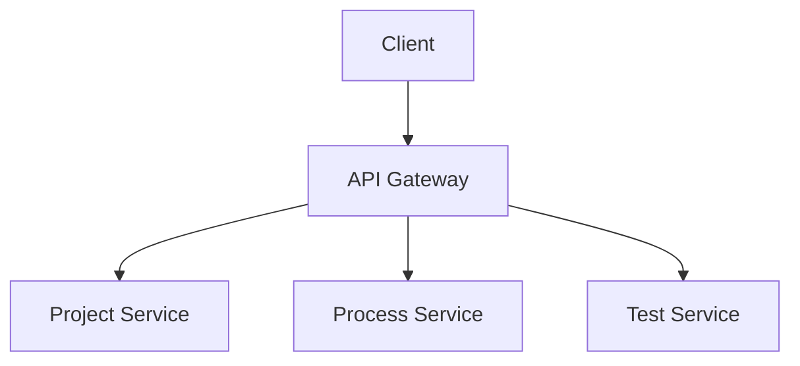

# SoftwareProject overview

## About the Platform

Our software platform provides robust tools for project management and process automation. This overview will help you understand the core capabilities and architecture.

### Architecture Diagram

### Key Components

1. Project Service: Handles project creation and management
2. Process Service: Manages automated workflows
3. Test Service: Handles test execution and reporting

!!! note "Integration"
    All services communicate through a secure API Gateway. Learn more in the [Installation Guide](installation.md).

---
